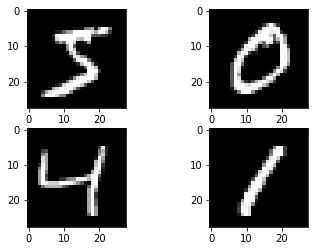

# Digit Classifier using convolutional neural network or CNN model


```python
import tensorflow as tf
from keras.datasets import mnist
import matplotlib.pyplot as plt
from sklearn.model_selection import train_test_split
```

    Using TensorFlow backend.
    


```python
import numpy
print(numpy.__version__)
print(numpy.__path__)
```

    1.18.1
    ['C:\\Users\\arahman\\Anaconda3\\lib\\site-packages\\numpy']
    

Loading and split the data set


```python
dataset = mnist.load_data()
(X_train, y_train), (X_test, y_test) = dataset

# Production Set
(X, y) = dataset
```

Visualise data as grey scale


```python
plt.subplot(221)
plt.imshow(X_train[0], cmap=plt.get_cmap('gray'))
plt.subplot(222)
plt.imshow(X_train[1], cmap=plt.get_cmap('gray'))
plt.subplot(223)
plt.imshow(X_train[2], cmap=plt.get_cmap('gray'))
plt.subplot(224)
plt.imshow(X_train[3], cmap=plt.get_cmap('gray'))
# show the plot
plt.show()
```





# I will be demonstrating how to use all of the aspects of a modern CNN implementation, including Convolutional layers, Pooling layers and Dropout layers


```python
import pandas as pd
import numpy as np
from keras.models import Sequential
from keras.layers import Dense
from keras.layers import Dropout
from keras.layers import Flatten
from keras.layers.convolutional import Conv2D
from keras.layers.convolutional import MaxPooling2D
from keras.utils import np_utils
```

# Prepping the dataset

I need to reshape the image so it is sutable to train


```python
# reshape to be [samples][width][height][channels]

X_train = X_train.reshape(X_train.shape[0], 28, 28, 1).astype('float32')
X_test = X_test.reshape(X_test.shape[0], 28, 28, 1).astype('float32')
```

The pixel values are gray scale between 0 and 255, therefore I must impliment normalisation to reduce the numbers to a range of 0-1 (Feature scailing)
this is perfect to optimise the dataset so it si less computationally expensive


```python
# normalize inputs from 0-255 to 0-1

X_train = X_train / 255
X_test = X_test / 255
```

I need to convert the vector output to binary matrix using one hot encoding, as there will be mutlipul outputs this is considered a multiclass classification problem


```python
# one hot encode outputs
y_train = np_utils.to_categorical(y_train)
y_test = np_utils.to_categorical(y_test)
```

# Defining the model

Convolutional neural networks are more complex than standard multi-layer perceptrons, so we will start by using a simple structure to begin with that uses all of the elements for state of the art results. Below summarizes the network architecture.

1, The first hidden layer is a convolutional layer called a Convolution2D. The layer has 32 feature maps, which with the size of 5×5 and a rectifier activation function. This is the input layer, expecting images with the structure outline above [pixels][width][height].

2, Next we define a pooling layer that takes the max called MaxPooling2D. It is configured with a pool size of 2×2.

3, The next layer is a regularization layer using dropout called Dropout. It is configured to randomly exclude 20% of neurons in the layer in order to reduce overfitting.

4, Next is a layer that converts the 2D matrix data to a vector called Flatten. It allows the output to be processed by standard fully connected layers.

5, Next a fully connected layer with 128 neurons and rectifier activation function.

6, Finally, the output layer has 10 neurons for the 10 classes and a softmax activation function to output probability-like predictions for each class.


```python
num_classes = 10
batch_size = 120
epochs = 10

# define a simple CNN model
def baseline_model():
    # create model
    model = Sequential()
    model.add(Conv2D(32, (5, 5), input_shape=(28, 28, 1), activation='relu'))
    model.add(MaxPooling2D())
    model.add(Dropout(0.2))
    model.add(Flatten())
    model.add(Dense(128, activation='relu'))
    model.add(Dense(num_classes, activation='softmax'))
    # Compile model
    model.compile(loss='categorical_crossentropy', optimizer='adam', metrics=['accuracy'])
    return model
```


```python
# build the model
model = baseline_model()
# Fit the model
model.fit(X_train, y_train, validation_data=(X_test, y_test), epochs=epochs, batch_size=batch_size)
# Final evaluation of the model
scores = model.evaluate(X_test, y_test, verbose=0)
print("CNN Error: %.2f%%" % (100-scores[1]*100))
```

    Train on 60000 samples, validate on 10000 samples
    Epoch 1/10
    60000/60000 [==============================] - 33s 546us/step - loss: 0.1962 - accuracy: 0.9433 - val_loss: 0.0651 - val_accuracy: 0.9790
    Epoch 2/10
    60000/60000 [==============================] - 34s 562us/step - loss: 0.0621 - accuracy: 0.9810 - val_loss: 0.0483 - val_accuracy: 0.9832
    Epoch 3/10
    60000/60000 [==============================] - 35s 581us/step - loss: 0.0455 - accuracy: 0.9866 - val_loss: 0.0407 - val_accuracy: 0.9866
    Epoch 4/10
    60000/60000 [==============================] - 35s 588us/step - loss: 0.0352 - accuracy: 0.9894 - val_loss: 0.0332 - val_accuracy: 0.9883
    Epoch 5/10
    60000/60000 [==============================] - 35s 588us/step - loss: 0.0273 - accuracy: 0.9912 - val_loss: 0.0303 - val_accuracy: 0.9894
    Epoch 6/10
    60000/60000 [==============================] - 35s 588us/step - loss: 0.0223 - accuracy: 0.9929 - val_loss: 0.0323 - val_accuracy: 0.9890
    Epoch 7/10
    60000/60000 [==============================] - 35s 591us/step - loss: 0.0192 - accuracy: 0.9935 - val_loss: 0.0325 - val_accuracy: 0.9902
    Epoch 8/10
    60000/60000 [==============================] - 35s 584us/step - loss: 0.0154 - accuracy: 0.9948 - val_loss: 0.0382 - val_accuracy: 0.9885
    Epoch 9/10
    60000/60000 [==============================] - 35s 591us/step - loss: 0.0131 - accuracy: 0.9956 - val_loss: 0.0309 - val_accuracy: 0.9900
    Epoch 10/10
    60000/60000 [==============================] - 36s 594us/step - loss: 0.0101 - accuracy: 0.9967 - val_loss: 0.0353 - val_accuracy: 0.9896
    CNN Error: 1.04%
    


```python
model.save('mnist.h5')
print("Saving the model as mnist.h5")
```

    Saving the model as mnist.h5
    


```python
# Example of a simple NN:

#build the model
#model = Sequential()
#model.add(Dense(num_pixels, input_dim=num_pixels, kernel_initializer='normal', activation='relu'))
#model.add(Dense(num_classes, kernel_initializer='normal', activation='softmax'))
# Compile model
#model.compile(loss='categorical_crossentropy', optimizer='adam', metrics=['accuracy'])
#Fit the model
#model.fit(X_train, y_train, validation_data=(X_test, y_test), epochs=10, batch_size=200, verbose=2)
#Final evaluation of the model
#scores = model.evaluate(X_test, y_test, verbose=0)
#print("Baseline Error: %.2f%%" % (100-scores[1]*100))
```

NOTE:
    
The batch size is a hyperparameter of gradient descent that controls the number of training samples to work through before the model’s internal parameters are updated.

The number of epochs is a hyperparameter of gradient descent that controls the number of complete passes through the training dataset.
As the number of epochs increases, more number of times the weight are changed in the neural network and the curve goes from underfitting to optimal to overfitting curve.

Reference: 

https://medium.com/@RaghavPrabhu/understanding-of-convolutional-neural-network-cnn-deep-learning-99760835f148

https://machinelearningmastery.com/difference-between-a-batch-and-an-epoch/
